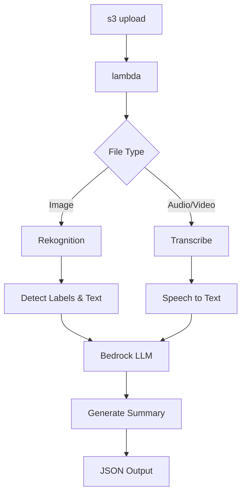

# Aws-Multimodal-Summary
Image & Video to Text Summarization (AWS Serverless)

# 📌 Overview

This project is a serverless application built using AWS SAM that processes images, audio, and video files uploaded to S3. It extracts meaningful information and generates summaries using AWS AI services.

---


  # 🖼️ Image Processing
  - Detects labels using  Amazon Rekognition 
  - Extracts text from images
  - Generates structured descriptions using an LLM (Bedrock)
  # 🎧 Audio/Video Processing 
  - Converts speech to text using Amazon Transcribe
  - Summarizes transcripts into structured outputs (meeting notes, lecture notes, reviews, etc.)
  # ⚡ Serverless Architecture  
  - AWS Lambda
  - API Gateway
  - S3 event-driven processing
---
# 🛠 Tech Stack
- Aws Lambda
- S3
- Aws Transcribe
- Aws Rekognition
- Aws sam
- Bedrock llm

---
# 🏗️ Architecture


---
 
# 📂 Project Structure
```
├── hello_world/
│   ├── app.py              # Lambda function
│   └── requirements.txt   # Dependencies
├── template.yaml          # AWS SAM template
└── README.md
```
---
# 🔑 Environment Variables

MODEL_ID=Bedrock model ID (e.g. openai.gpt-oss-20b-1:0)

---
# 🚀 Deployment (AWS SAM)
  1. Build the application
      sam build
  2. Deploy
      sam deploy --guided
# 🧪 Sample Event (S3 Trigger)
```
{
  "Records": [
    {
      "s3": {
        "bucket": { "name": "samplebucket" },
        "object": { "key": "sample_image.jpg" }
      }
    }
  ]
}
```
---

# 🧠 Processing Logic
   # Image Flow
     - Detect labels (Rekognition)
     - Detect text (Rekognition)
     - Send to Bedrock LLM
     - Generate structured description
  # Video/Audio Flow
    - Start transcription job
    - Poll until completion
    - Extract transcript
    - Send to Bedrock LLM
    - Generate summary based on content type

---
# ⚠️ Notes & Limitations
-Lambda timeout is set to 300 seconds

Bedrock response parsing assumes: result["choices"][0]["message"]["content"]
(May vary depending on model)

---
# 🔐 IAM Permissions
The Lambda function requires:
```
bedrock:InvokeModel
rekognition:DetectLabels
rekognition:DetectText
transcribe:StartTranscriptionJob
transcribe:GetTranscriptionJob
s3:GetObject
```
---
# 🧪Sample output
  # 1. Image Example
        Input: Image of a boy playing with a dog
        Output:
        Boy in shorts playing with a collie dog on grass in a park

  # 2. Video Example
        Use Case: Meeting transcript
        Summary Output:

          - Identified trend of chronic absenteeism, especially on Fridays
          - Plan to hold a pancake breakfast to improve attendance
          - Suggest posting health tips for flu season awareness
          -Identified student (John Smith) facing personal challenges
          Decision: Refer student to guidance counselor
          Action: Provide childcare support resources for family

---
# 🛠️ Future Improvements
    - Add frontend UI to upload files, store results in S3, and automatically delete after processing using EventBridge.
    - Improve prompt engineering for better summaries
    - Add speaker identification for meeting summaries
---
# 👨‍💻 Conclusion

Built an AWS serverless multimodal summarization pipeline that automatically processes images, audio, and video to generate structured summaries using Amazon Rekognition, Transcribe, and Bedrock. Designed the workflow using Lambda and S3 events, demonstrating cloud-native AI engineering and end-to-end data-to-insight pipeline skills.
